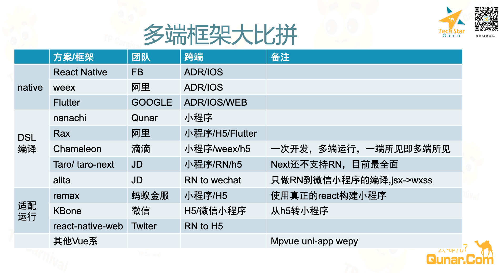
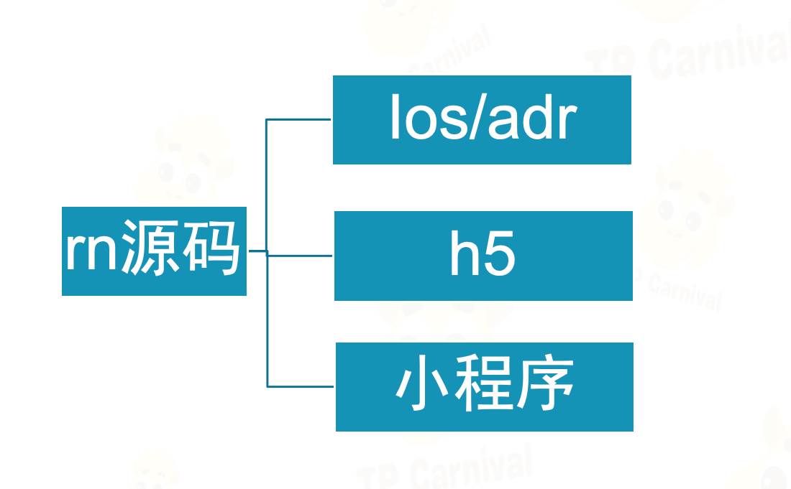
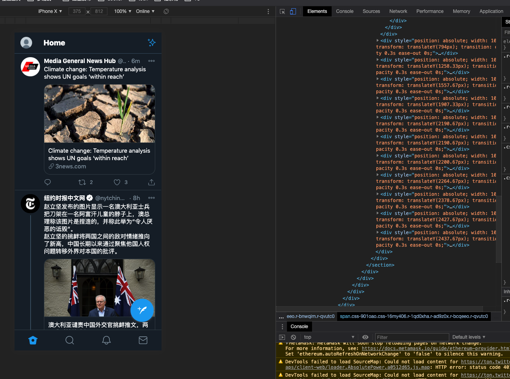
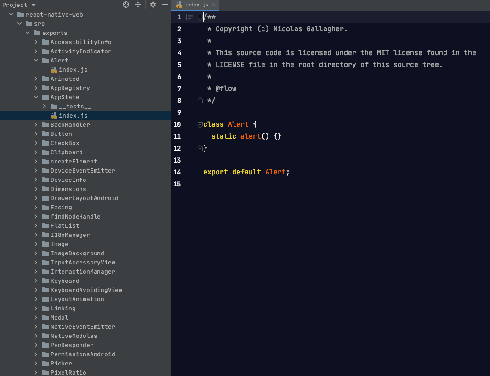
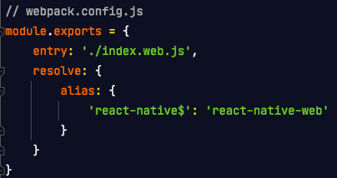
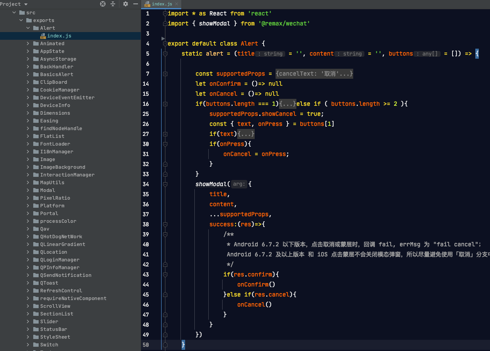
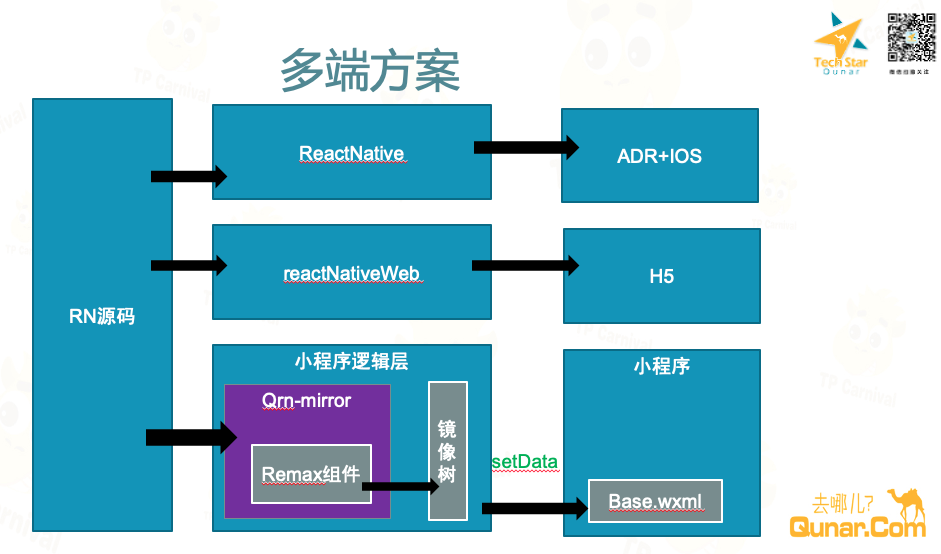
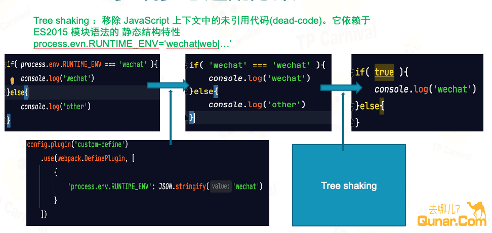
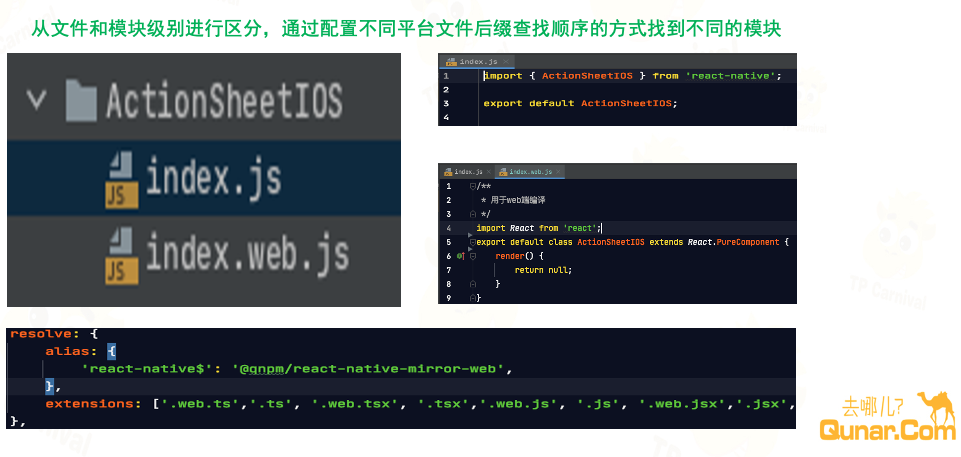
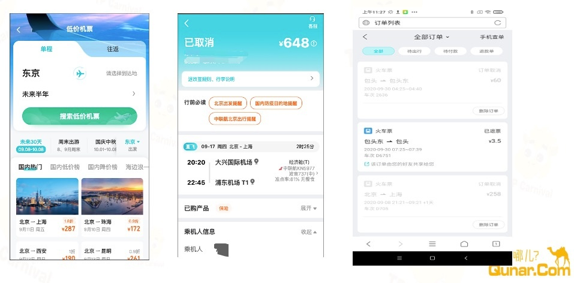

# 方案原理介绍
## 方案背景
长期以来APP、H5、小程序等各个端的定位和发展历程都不一样，各端技术栈差异性也较大，基于成本和效率考虑并不追求各端一致性，结果就是各端真的就渐行渐远了。

移动端增量红利越来越少的情况下，产品这边逐渐追求各端的产品体验一致性，多端同时上的需求越来越多，但是由于技术上割裂较大，工时基本都会按端加倍，开发成本奇高，迫切的需要一套减少多端开发成本的方案。

## 方案调研
开始之前我们对业界现有的一些跨端方案进行了简单的调研和了解

通过对比目前的多端开发主要有以下几个大方向
1. 对 IOS和 ADR 的native端APP的适配
2. 中国特色的针对各小程序平台的适配
3. 都希望可以兼顾到对H5的转换

而实现方向上看起来五花八门，但总体思路上主要还是两个大方向

1. 提供自定义DSL静态编译转化成目标源代码(运行体验好)
2. 运行时适配兼容(开发体验好)

这两种方式的优缺点都非常明显(相关框架和方案对比文章都较多，可自行详细了解)。目前社区基本都想在运行时上努力，开发当然要自己爽啊，实际体验下来除了在微信小程序上性能问题较大也没啥大毛病。

taro作为较早的多端方案，适配性和兼容性都不错，自定义DSL，JSX由于其转译复杂性限制也较多。

taro-next和remax都是运行时适配的方案，而remax的口号是 “使用真正的react构建小程序” (好好体会后面要考)。

Chameleon是号称兼容性和运行效率上都比较高的，编译和运行时适配的技术都用到了，不过由于他是支持的weex就没做深入尝试了。

其他像alita,KBone，react-native-web都在自己的小领域内能较好的运行。

## 方案介绍
### 解决思路
调研完发现上面的方案其实并不能很好的直接解决我们的问题：

1. Qunar整体技术栈以react为主，几年前已将APP整体迁移到RN技术栈上，解决了IOS和ADR的2端问题
2. APP的体验和开发是最重要的，不能为了多端用新的DSL语法来限制对RN技术的使用，降低RN的性能和开发体验

基于现状其实我们想要的是 能直接将RN转换到H5和各小程序平台 的多端方案，可惜没有。

不能直接找到一次将RN运行到多端的方案，其实如果能分别解决RN到H5和RN到小程序的问题也是能达到目标的，分析前面的跨端方案还是有一定可行性的。

### RN到H5

react-native-web是Twitter开源的可将RN代码运行在H5上的方案，而且他们H5端的官网就是直接用RN转出来的，自信到连自己主站都敢用的方案肯定是要尝试一下的，于是出去看了下线上效果

发现保真度和体验还可以，对该方案的实现原理进行了解之后，觉得H5可行，后续到小程序的方案也深受启发。

### react-native-web原理

先看一行RN代码

再看react-native-web的源代码

使用方式

他的方案其实挺简单粗暴的，把RN的组件和API都用H5实现适配一遍，适配其行为和默认样式，在打包的时候使用webpack的别名机制将用到的组件替换成react-native-web里的对应组件。

简单的方案实现起来工作量还是挺大的，所以react-native-web里也大量的直接使用了react-native的源代码，谁让他们都是JS呢。

既然到H5可以这么简单粗暴，那到小程序是否可以呢？

### RN到小程序
我们知道小程序都有一套自己的DSL语言，而且与常规前端不同的是他将逻辑层和视图层完全隔离在了两个线程里，两边数据和对象都不共享，只能通过Native层来传递数据通讯。

RN广义上来说也是一样的双线程机制，不过RN的渲染是用的native,小程序用的是webkit。

RN是完全基于React语言的，比小程序的DSL要灵活复杂得多，要把React语法和JSX编译成一个子集的话困难性还是很大的。

这个时候我们想到了remax： 使用真正的react构建小程序。

如果我们像 react-native-web一样，把react-native组件用remax来实现一遍，是不是就可以将RN运行到小程序上了呢？

### remax实现原理
这部分网上有详细的原理介绍，这里只简单说一下：

react在内部做完VirtualDOM的更新后最终都要调用宿主环境的更新方法(add remove)来更新界面，为了更好地对接各个平台react提供了react-reconciler库来传入真正宿主元素的更新方法(HostConfig)。基于这个库可以方便的实现出ReactDOM、RN等react渲染层。remax就是基于该组件实现的一个react的渲染层，不过小程序里不能直接去更新界面，所以reamx会把更新收集起来，然后生成一个更新数据通过小程序的setData触发渲染层的更新。然后在小程序渲染层实现一个通用模板来渲染这些数据。

这个方案带来的好处和缺点，在微信小程序里的性能限制下面remax和taro next的原理介绍里都讲得很透彻，这里就不在复述了。

remax原理介绍 ( [文档地址](https://remaxjs.org/) ) 

taro next也采用了类似的原理：[文档地址](https://juejin.cn/post/6844904036743774216)

### RN到小程序组件库

基本原理同react-natvie-web，只不过在对RN组件的具体实现上采用直接使用对接到remax组件上的方式。看代码例子的话目录结构等是不是都和react-native-web很像。

## 最终多端方案

最终经过调研和尝试，我们选择了按平台用不用的方案进行转换的方案：

1. H5上直接用react-native-web进行转换
2. 到小程序端使用reamx组件实现一套RN的组件库，借用remax来适配到多端
3. 借助webpack的特性来实现针对不同平台的打包

qrn-mirror就是前面提到的针对RN组件到小程序的组件适配库，使用remax实现。

我们的主要工作量集中在qrn-mirror层对RN组件的适配，借助现有开源方案小成本的实现了这个事情。

当然在实现小程序组件的时候我们才理解 remax 只说了 “使用真正的react构建小程序” ， 从来没说过支持多端一致的，这差别你体会体会。。。不过幸运的是remax确实也通过remax/one提供了多个多端兼容的基础组件。当然我们最终还是选择继续使用remax来开发了组件库，谁让他是完整支持react的呢，另一个我们也不追求一次把所有小程序端都适配了。

## 多端多态方案

前面实现了将RN代码在多端运行的机制，但是在实际迁移中并不是所有的RN特性小程序和H5都能支持，产品和交互本身也有差异，这时候还是需要对各端做差异化和降级的。

如何做到多态其实webpack都已经替我们做好了，我们只需要用和定好规范就好了。

### 文件内小范围的多态

借助webpack的tree shaking和 webpack.DefinePlugin插件，可是实现按端执行逻辑且不出现冗余代码。

### 文件组件级别的多态

受益于react良好的组件化机制，只要我们按文件导出同样API的react组件,可以无缝的针对多端做替换。remax也能做到自动识别小程序的原生组件。而我们只需要根据平台动态修改webpack查找文件后缀的优先级顺序就好了。

最终打包时在H5端使用 index.web.js内导出的兼容组件，其他端用index.js里导出的组件。

## 效果展示

最终我们实现了一个开发开发工具，在规范RN工程目录结构的情况下可以一键转换出H5和小程序的版本。目前已经在低价机票，机票订单详情，公共订单列表等项目中进行了应用。后续也希望在主流程和更多新项目中直接使用。

